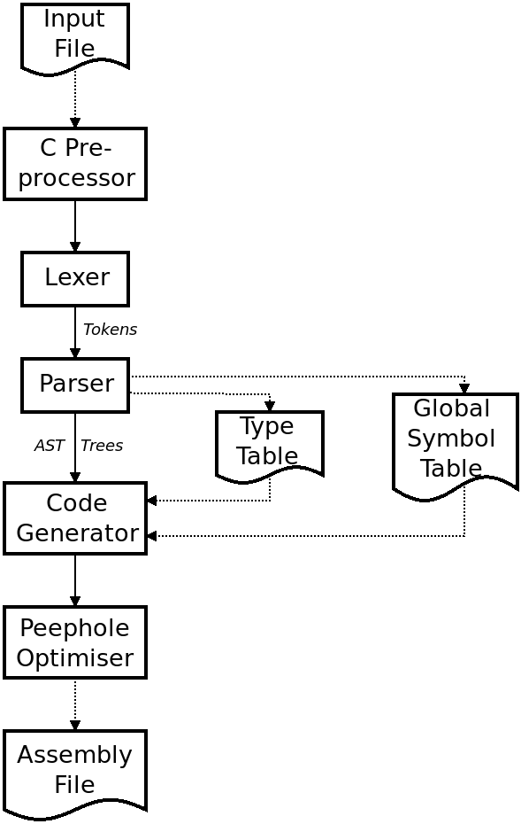

# alic Part 1: Goals, Issues and a Roadmap

The *alic* language was inspired by C, and I've tried to make *alic* an "improved" C with some nice features and much less undefined behaviour.

Dennis Ritchie [wrote the first C compiler on the PDP-11 platform](https://www.nokia.com/bell-labs/about/dennis-m-ritchie/chist.html). Given that *alic* is an "improved" C, I thought it would be fun(!) to port *alic* to the PDP-11 platform.

OK, this isn't going to be easy at all, as the PDP-11 is a 16-bit architecture with a lot less memory than the 64-bit platforms that *alic* currently runs on. I'm going to target the [PDP-11/70](https://gunkies.org/wiki/PDP-11/70) as it provides each program with 64K of instruction space as well as 64K of code space (so-called "split I&D" memory).

The [Open SIMH](https://opensimh.org/) simulator can run [2.11BSD](https://minnie.tuhs.org/cgi-bin/utree.pl?file=2.11BSD) on a simulated PDP-11/70 with a C compiler and some debugging tools. This is going to be the simulated operating system and hardware platform that I will aim to get *alic* to run on.

## Goals

My main goal is to get the *alic* compiler, written in the *alic* language, to be able to compile itself on the PDP-11/70. To do this, I am going to need to get the *alic* compiler, written in C, to compile using the existing C compiler.

A secondary goal is to make *alic* a useful language on the PDP-11 platform. I'd like to get it to produce reasonably efficient code, and to be able to compile fairly large programs.

## Issues

The absolute biggest issue is that of limited memory. Any program that runs on the PDP-11/70 has 65,535 *bytes* of code space and 65,535 *bytes* of data space! You might think that it is going to be impossible to fit an *alic* compiler into this amount of memory. Luckily, I attacked this sort of issue when I [ported my `acwj` compiler to the 6809 microprocessor](https://github.com/DoctorWkt/acwj/tree/master/64_6809_Target). I should be able to use some of the techniques I used there with *alic*.

Unlike the 6809, the PDP-11/70 has a diverse range of instructions, so I don't think it will be too hard to translate the QBE code over to produce PDP-11/70 assembly code. I will have to bring in things like register allocation and probably a peephole optimiser to improve the resulting code density.

## Reducing the Code Size

One way to get the *alic* compiler to fit into 64K of code space is to break it up into several separate programs. My vision, at present, looks something like this:

There are six phases to the compiler as shown, which are connected by a uni-directional flow of data (which could be a pipeline). We start with the input code in a text file and end with an assembly text file. The parser and code generator share two files, one for the global symbol table and another for the declared types. I know that, because of the number of include files that a source file can bring in, the global symbol table can get very large; it's better to keep it on disk. The table for new types may fit in memory, but I'll leave it out on disk for now. There are usually not too many local variables, so we can pass these from the parser to the code generator in the AST trees and keep them in memory.

If code space really gets tight, I may have to remove some of the language features in *alic*. But I'll cross that bridge when I need to.

## Reducing the Data Size

In terms of reducing the amount of data each phase of the compiler will use, there are several things we can do.

The first is to move some data structures out to disk, as shown by the type table and global symbol table above.

The second is to try and `free()` up any dynamically allocated memory object which is no longer required.

One more design change I can make is to reduce the size of the memory structures, e.g. the `Sym`, `Type` and `ASTnode` structs. There are a lot of members which are seldom used, and members which are mutually exclusive. For example, the `lower` and `upper` members of the `Type` struct are only used by integer types with ranges, and the `rettype`, `paramtype` and `excepttype` members are only used by function pointers. I should be able to put these in a union to reduce the memory footprint and without disturbing the code base to any great extent.

## The PDP-11 Code Generator

I am definitely going to have to completely replace the QBE code generation in `cgen.c` and get it to output PDP-11 assembly code. I will also have to do things like register allocation and spilling. I've done this before in [the acwj compiler](https://github.com/DoctorWkt/acwj), so I can borrow some of the code ideas from there.

## A Roadmap For This Project

Based on the above, here is what I think will be my major steps:

  * Keep the QBE backend and break the existing compiler in C up into the phases shown above. Ensure that it still passes all the tests.
  * Put this compiler on a "data diet": add `free()`s where I can, put struct members into unions etc. Where I can, try to start using 16-bit and 32-bit integers instead of 64-bit integers. Ensure that it still passes all the tests. Write tools to dump the token stream from the lexer, the AST trees from the parser, and the type & symbol tables.

I'll do this on my existing Devuan Linux platform where I have a good set of debugging tools. Next up:

  * One at a time, get each phase to compile on the PDP-11 and verify that its output matches that of the compiler on the Devuan Linux platform.
  * On the Devuan Linux platform, rewrite the code generator to produce PDP-11 assembly code. Use a PDP-11 simulator to check that the assembly code that is produced is correct.
  * Bring in a peephole optimiser and write a lot of rules to help produce reasonably optimised assembly code output. Ensure that the comiler passes all the tests.
  * Finally, rewrite this new compiler in the *alic* language and get it to self-compile on the PDP-11 platform.

## Conclusion and The Next Step

So that's my plan of attack. It's going to take quite a while to achieve!

The next step is to start breaking the existing compiler up into several phases. That will mean working out how to serialise AST trees!