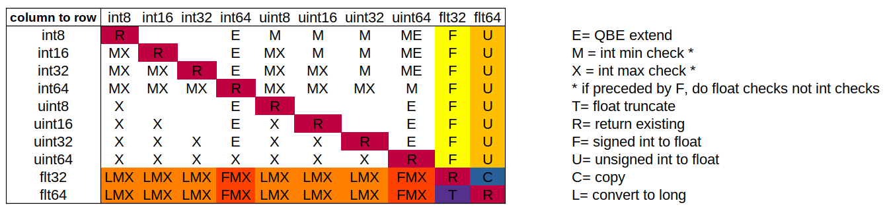

# *alic* Part 14: Adding `const` and `cast()` to *alic*

In this part of the *alic* journey, I've added the `const` keyword and the `cast()` pseudo-function to the language. As with most of my *alic* features, I'm trying to improve on C by:

  * making the language a bit nicer, e.g. named function arguments,
  * trying to reduce undefined behaviour, e.g. array bounds checking, and
  * trying to make the language a bit safer, e.g. `unsigned()` checking but no type casting.


`const` falls into the latter two categories. We should be able to mark variables and data `const`, so that it can't be changed accidentally. And `cast()` deals with some of the work that type casting does in C except with run-time value checking. Let's start with `const`.

## The `const` semantics in *alic*

I purposefully didn't look at the C semantics for the `const` keyword. Instead, I sat down and thought about what I would use it for. Hence, the *alic* semantics for `const` are probably slightly different to the C semantics.

Obviously, `const` is a programmer-driven construct: the programmer has to choose to use it. This differs from array bounds checking, for example, which is done by the compiler.

So, here is what the programmer can use `const` for (taken from the *alic* overview document):

The `const` keyword can be applied to:

  * global variable declarations after any `extern` or `public`,
  * parameter and local variable declarations,
  * before any string literals, 
  * struct members in the type definition, and
  * assignment statements.

The `const` keyword has the following meanings.

For scalar variables, once the variable is declared with any initialisation its value cannot be changed. Example:

```
  const int32 x = y + 7;
  x= 5;                     // Not permitted
```

For pointer variables, after the initialisation the pointer cannot be pointed at anything else. However, the value that it points to can be changed. Example:

```
  char *name= "Fred Bloggs";
  const char *ptr = name;        // ptr points at name
  char *addr= "23 Blah st";

  ptr= addr;                     // Not permitted
  *ptr= "G";                     // Permitted: 'F' is changed to 'G'
```

For array variables, after the initialisation no value in the array can be changed. Example:

```
const int32 x[5]= { 2, 4, 6, 8, 10 };

public void main(void) {
  x[3]= 100;                     // Not permitted
}
```

For struct variables, after the initialisation no member value in the struct can be changed. Example:

```
type FOO = struct {
  int32 x,
  int8 y,
  flt32 z
};

const FOO fred = { 100, -3, 3.14 };

public void main(void) {
  fred.y = 45;                      // Not permitted
}
```

For struct members, after the initialisation the member's value in the struct cannot be changed. Example:

```
type FOO = struct {
  int32 x,
  const int8 y,
  flt32 z
};

FOO fred = { 100, -3, 3.14 };

public void main(void) {
  fred.x = 300;                     // Permitted
  fred.y = 45;                      // Not permitted
}
```

The `const` keyword can also precede string literals. In this situation, no characters in the string literal can be changed. Example:

```
public void main(void) {
  char *name= const "Fred Bloggs";

  *name = 'G';                      // Not permitted
  name[2] = 'x';                    // Not permitted
  name = NULL;                      // Permitted as name isn't const
}
```

In an assignment statement the word `const` following the `=` sign tells the compiler to mark the variable as being `const`. Any future assignments to the variable, as seen at compile time only, will be treated as an error. Example:

```
public void main(void) {
  int32 result;

  result = 7;       // Result set to 7
  result = const;   // Now it cannot be changed
  result= 100;      // Not permitted
```

You can do this to single variable names: scalars, array names, struct names.
You can't do this (using the `.` operator) to make individual array elements
or struct members `const`.

A `const` violation via an assignment is detected at compile time and will produce an error message like this: `input.al line 6: Cannot change a const variable`.

Global `const` variables and `const` string literals will be stored in the read-only data section in the final executable. Thus, if you try to circumvent their `const` attribute (e.g. by taking a pointer to them and then assigning to a value at that pointer), your program will stop with a segmentation fault.

## Adding `const` to the Compiler

The change to the *alic* grammar was just a few rule changes. But adding the actual `const` semantics meant that I had to add/change code to pretty much every source file in the compiler. Let's start with the grammar changes:

```
typed_declaration= CONST? type IDENT

short_assign_stmt= postfix_variable ASSIGN expression
                 | postfix_variable ASSIGN CONST
                 ...

primary_expression= NUMLIT
                  | CONST? STRLIT
                  ...
```

That's it! For variables and struct members, the typed declaration can now be preceded by an optional `const`. We can assign `const` to a variable, which just adds the `const` attribute to it. And string literals can be preceded by an optional `const`. Now let's look at the changes to the compiler.

There's a new keyword `const` and associated token type `T_CONST` which affects [alic.h](alic.h) and [lexer.c](lexer.c). The changes to the parsing in [parser.c](parser.c) are negligible and I won't go through them.

We need to track which symbols, parameters and struct members are marked as `const`. And, because these declarations are stored in `ASTnode`s while parsing, both the `Sym` and `ASTnode` structs in [alic.h](alic.h) have this member added:

```
  bool is_const;                // Is the variable constant
``` 

The `Strlit` struct, used for string literals, also has this added to it. We can now record what things should be treated as constant; now let's add the semantic handling for this.

There are mainly three things to deal with:

 1. Recording in the `Sym` and `Strlit` structs which variables and strings need to be protected.
 2. When performing assignments, a) preventing variables and members marked `const` from being changed, and b) marking them as `const` if we assign the `const` keyword to them.
 3. Storing `const` global variables and string literals in the read-only data section.

## Recording the `const` attribute

This was mostly "dotting 'i's and crossing 't's" with the code. We mainly have to "bubble up" any low-level `ASTnode` which represents a `const` variable up to the point where we use it in an assignment. The issue here is this could be something like:

```
   a.b[20].c.[d100].e = 5;
```

where `e` is a struct member marked `const`.

Most of this code is in [parser.c](parser.c), but there is some in the other C source files. Look for lines that say:

```
  <struct>->is_const= <other struct>->is_const;
```

One interesting one is in `postfix_variable()` in [parser.c](parser.c) when we have to protect a single struct member instead of the whole struct: in this case we *don't* "bubble up" the underlying symbol's `const` attribute:

```
      // If the member is marked const, set this node's const
      // attribute to true. Otherwise, bubble up the left
      // child's const attribute if it not a pointer.
      if (memb->is_const)
        n->is_const= true;
      else if (is_ptr==false)
        n->is_const= n->left->is_const;
```

The "if not a pointer" thing was a side-effect that I hadn't considered fully. Imagine a `const` pointer to a struct, e.g.

```
  const FOO *fred= malloc(sizeof(FOO));
```

This means that we cannot re-point `fred` at some other memory, but we can alter the contents that `fred` points to. But when I tried to do `fred.a = 32;` it failed. That's because I was bubbling up `fred`'s `const` attribute even though `fred` was a pointer. Hence the "if not a pointer" test. If `fred` was a struct and not a struct pointer, then I need to bubble up its `const` attribute.

## Assigning `const` to a Variable

This is done in `short_assign_stmt()` in [parser.c](parser.c). Just after we scan in the `=` token, we see if it is followed by the `const` keyword. If so, and the variable is a simple idenfitier, we mark the symbol's `is_const` to be true.

## Preventing Changes to `const` variables

There exactly one place where we need to check the `is_const` attribute to prevent variables from being changed. In `assignment_statement()` in [stmts.c](stmts.c):

```
 // Don't allow assigning to a const identifier
 if (v->is_const)
   fatal("Cannot change a const variable\n");
```

So, we put all the work in to ensuring the `const` attribute makes it up to the top `ASTnode`s in the assignment statement where we check it and fail if needed. 

## Putting Data in the Read-Only Section

This was also easy: we have to deal with the QBE output for global variables and string literals. The changes are in [cgen.c](cgen.c). I'll just show you one of them:

```
void cgstrlit(int label, char *val, bool is_const) {
  char *cptr;

  // Put constant string literals in the rodata section
  if (is_const)
    fprintf(Outfh, "section \".rodata\"\n");

  fprintf(Outfh, "data $L%d = { ", label);
  ...
}
```

## Testing `const`

Tests 148 to 158 in the [tests/](tests/) directory are the ones to look at for `const` testing. I'm sure I could add a heap more of them!

## Putting `const` into Practice

Now that I have `const`, let's use it in anger. I have a 6,600 line compiler written in *alic*, so let's see if `const` helps.

The first thing I did was decorate all the parameters in function declarations and prototypes as being `const`. That way, I could see which parameters I was changing (i.e. now a fatal error). I could then check that any parameter change was sensible. I didn't find anything, but it was good to help me check my parameter use.

Next up, in [types.al](cina/types.al) we make a linked list of built-in `Type` nodes in the function `init_typelist()`. After the list is made, I mark all of the individual nodes as being `const`:

```
  // Make the built-in linked list constant
  ty_void    = const;
  ty_bool    = const;
  ty_int8    = const;
  ty_int16   = const;
  ty_int32   = const;
  ty_int64   = const;
  ty_uint8   = const;
  ty_uint16  = const;
  ty_uint32  = const;
  ty_uint64  = const;
  ty_flt32   = const;
  ty_flt64   = const;
  ty_voidptr = const;
  ty_int8ptr = const;
```

So if I inadvertently touch these variables later on in [types.al](cina/types.al), the compiler will tell me.

And, being a bit naughty, I then marked these variables as being `const` in [alic.ah](alic.ah):

```
extern const Type *ty_void;	// The built-in types
extern const Type *ty_bool;
extern const Type *ty_int8;
extern const Type *ty_int16;
extern const Type *ty_int32;
extern const Type *ty_int64;
extern const Type *ty_uint8;
extern const Type *ty_uint16;
extern const Type *ty_uint32;
extern const Type *ty_uint64;
extern const Type *ty_flt32;
extern const Type *ty_flt64;
extern const Type *ty_voidptr;
extern const Type *ty_int8ptr;
```

That should stop other source files from touching them.

Yes, it's not a perfect panacea, but I can see that I will use this going forward. It's like adding an extra check on my code to help me spot mistakes.

## The `unsigned()` Pseudo-Function Recast

I was writing an example program in *alic* and I needed a small random number. When I wrote this line:

```
   int8 num= rand() & 0xf;        // Get a random number between 0 and 15
```

the compiler complained that `rand()` was returning an `int32` and that wasn't compatible with the `int8` type. Yes, that's exactly what I wanted: to prevent type casting which could lead to undefined behaviour. But I *really* do want to get an 8-bit random number.

So it's time to add type casting to the *alic* language but in a way that prevents undefined behaviour. I've added a `cast()` pseudo-function to the *alic* language:

```
primary_expression= NUMLIT
                  ...
                  | cast_expression
                  ...

cast_expression= CAST LPAREN expression COMMA type PAREN
```

The `cast()` pseudo-function takes a numeric expression and a numeric type and converts the expression to the given type. This could be widening (which is done automatically anyway), changing signed values to unsigned (so it replaces `unsigned()`) and also narrowing the value. In fact, `cast()` can convert all ten numeric types to all ten numeric types: that's 90 different conversions (excluding when both have the same type).

To solve my problem above, I can now write:

```
   int8 num= cast(rand() & 0xf, int8);
```

`cast()` implements run-time range checking to ensure that the expression's value will fit into the range of the new type. The above will always work but this could fail at run-time:

```
  int8 num= cast(rand() & 0xff, int8);
```

as the expression `rand() & 0xff` has the range 0 .. 255 which won't fit into the `int8` range of -128 .. 127.

## Implementing `cast()` In The Compiler

We have the usual lexer changes: `unsigned` is gone as a keyword and it's replaced with `cast`. The parser's code for `unsigned_expression()` is replaced with `cast_expression()` which is very similar. We now have an `A_CAST` AST operation and an `A_WIDEN` operation: the first is done manually with `cast()`, the second is done automatically by the compiler.

I've discarded the old widening code and the unsigned conversion code in `cgen.c` with a single function: `cgcast()`. The function's description is:

```
// Given an expression's value in a temporary, the type of the expression,
// change the value to the given new type ty. This could mean a loss of
// precision (e.g. float to int, flt64 to flt32) or a change of range
// (e.g. int32 to int8, or int16 to uint32). Die with a fatal error if
// the value exceeds the new type's range.
int cgcast(int exprtemp, Type *ety, Type *ty, int funcname) { ... }
```

I started coding this function up, trying to merge the existing widen and unsigned code. Halfway through I realised that there were too many edge cases. So I sat down and worked out what needed to be done for each one of the 100 conversions. Here's my resulting table:



As you can see, the conversions to/from floats are generally consistent with one wrinkle which I'll explain below. The integer to integer conversions, however, are not so consistent.

I decided that the best way to do this was to:

  * return the expression value when the two types are identical (ten cases),
  * do the consistent int to float and float to float conversions (28 cases),
  * if needed, convert any float expression value to a signed/unsigned `int64` before
  * doing the remaining int to int conversions using a table-based approach.

Thus, as an example, `28.5` gets converted to an `int64` `28` before we apply the min/max rules to check that it will fit into an `int8` integer.

For the integer to integer conversions, we have to do these operations as needed:

  * check the expression's value is at or above the destination type's minimum,
  * check the expression's value is at or below the destination type's maximum, and
  * use a QBE extend operation to convert the value.

The wrinkle is the situation where we are converting a float value to `(u)int64`. We have to use a comparison against floating-point constants and not integer constants: how do we compare the expression value `2.0e19` (converted to integer value `20000000000000000000`) against `18446744073709551615` when `20000000000000000000` won't fit into a `uint64`?!

Here is the eight by eight table of conversion operations just before `cg_cast()` in [cgen.c](cgen.c):

```
// These are the actions we need to perform when
// converting one integer type to another integer type.
enum {
  C_E=1,                        // Use a QBE instruction to extend the size
  C_M=2,                        // Do a check on the type's minimum value
  C_X=4,                        // Do a check on the type's maximum value
  C_ME=3,                       // Combinations of the above
  C_MX=6
};
...
static Cvtrow cvt[8]= {
  { 0,    0,    0,    C_E, C_M,  C_M,  C_M,  C_ME },    // int8
  { C_MX, 0,    0,    C_E, C_MX, C_M,  C_M,  C_ME },    // int16
  { C_MX, C_MX, 0,    C_E, C_MX, C_MX, C_M,  C_ME },    // int32
  { C_MX, C_MX, C_MX, 0,   C_MX, C_MX, C_MX, C_M  },    // int64
  { C_X,  0,    0,    C_E, 0,    0,    0,    C_E  },    // uint8
  { C_X,  C_X,  0,    C_E, C_X,  0,    0,    C_E  },    // uint16
  { C_X,  C_X,  C_X,  C_E, C_X,  C_X,  0,    C_E  },    // uint32
  { C_X,  C_X,  C_X,  C_X, C_X,  C_X,  C_X,  0    }     // uint64
};
```

which corresponds to the spreadsheet above.

Overall there are about 160 lines of code in `cg_cast()` of which 25 are comments. I won't go through the code because it follows my outline above and I think the comments outline the overall algorithm.

Test 162 does all 100 type conversions using `cast()` as a check that it all does work as expected.

## Setting the Programmer's Mindset

I thought it might be time for me to talk a little bit about the mindset of programming in a language. Each language has its own idioms. One of the things I'm trying to do with *alic* is break away from the C mindset and encourage a *safer* mindset.

For example:

  * You have to decorate your functions as `public` if you want them to be visible elsewhere.
  * You can create a library and use an opaque type in a header file so that you don't leak internal details about the library's data structures.
  * You can declare all function parameters as `const`. Then, when the compiler complains, you can verify that you definitely need to alter the parameter's value and remove the `const`.
  * You know that arrays will be bounds checked at run-time.
  * If you need to change integer types, `cast()` will do it but it will cause a run-time value check. Your program may crash because of this, but you won't end up using some bogus value which could result in strange behaviour. And this also makes you think: how do I ensure the `cast()` range check will always succeed?

And if you do want to break the undefined behaviour rules, you can:

  * use a pointer and `malloc()` to make an array with no bounds check,
  * copy a pointer of one type into a `void *` pointer and then to a pointer of a dfferent type,
  * use unions in a struct to set one member, then use the value in another member to do type casting with no checks, etc.

But these actions are clearly visible in your code and are different from the usual *alic* idiom, so they are a sign that you are being "naughty"!

## QBE Backends

In the last part of the *alic* journey I said that I was going to try "porting" the compiler over to the two other CPUs that QBE supports: ARM64 and 64-bit RISC-V. The changes to ARM64 were very minimal: I just needed to statically link the *alic* version of the compiler in the `cina/` directory. This is probably because some libraries on my Raspbian installation need updating.

I did try to compile the compiler on my VisionFive 2 SBC which has a 64-bit RISC-V CPU. It nearly compiled but I hit a problem that I couldn't quickly fix. So it's there ready for me to tackle again in the near future!

## Conclusion and The Next Step

I really feel that I'm now heading out in a different direction to C with each new feature that I add to *alic*. Apart from the [cina/](cina/) compiler, I'm starting to write example programs in the *alic* mindset; it's fun!

In the next step of the *alic* journey, I have some ideas on `for` loop variants which I think will make things easier for the programmer. They are not fully formed in my mind yet, though.
