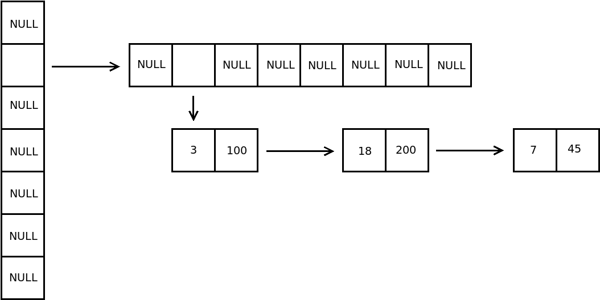

# *alic* Part 16: Associative Arrays

I've used [associative arrays](https://en.wikipedia.org/wiki/Associative_array) in several languages and I've always wished
that they were available in C. Now I can add them to *alic*!

To explain what they are and how to use them, I'll include below the
relevant material from the *alic* overview document.

## What Are Associative Arrays?

*alic* provides associative arrays: in-memory dynamic key/value stores with the following operations:

  * declare an associative array,
  * add (or update) a key/value pair to the array,
  * search the array with a key and get the associated value,
  * delete a key from the array,
  * test if a key/value pair exists in the array, and
  * iterate over the values in an array.

The value type can be any scalar value that fits into 64 bits: integers, floats, `bool` and pointers. The key type can be any integer type, `bool` and `int 8 *` (i.e. strings).

To declare an associative array, you give the type of the value and key and name the array, e.g.

```
  int32 age[int8 *];        // Array of ages keyed by person's name
  int8 *address[uint64];    // Array of address strings keyed by unsigned account number
```

To add a new key/value pair, or to update an existing key/value pair, use normal array syntax, e.g.

```
   age["Fred"]= 23;
   address[40325]= "101 Blah st, Foosville";
```

To get a value given a key, again use normal array syntax, e.g.

```
   if (age["Fred"] > 19) printf("Fred is no longer a teenager\n");
   printf("Account %ld, address %s\n", acct, address[acct]);
```

Note that if you try to get a value when the key doesn't exist, you will receive the value 0 (or `NULL` if the value type is a pointer). To properly tell if the key exists in the array, use the `exists()` pseudo-function which returns `bool`, e.g.

```
   if (exists(address[acct]))
      printf("Account %ld, address %s\n", acct, address[acct]);
   else
      printf("Account %ld has no address\n");
```

To delete a key in an associative array, use the `undef()` statement, e.g.

```
   undef(address[11112]);
```

You are permitted to delete keys that don't exist in the array.

To iterate over all the values in an associate array, use `foreach()`, e.g.

```
   int32 a;

   foreach a (age) printf("age %d in the list\n", a);
```

### Associative Array Notes

If you use pointer keys or values, remember that only the pointer values are stored in the associative array, not what they point at.

If you use a string as the key for an associative array, *alic* uses the [djb2 hash function](http://www.cse.yorku.ca/~oz/hash.html) to create a 64-bit key value to represent the string. There is a very small, but non-zero, chance that two strings will generate the same key value.

When iterating over the values in an associative array, there is no guarantee of any specific ordering of the values.

## Adding Associative Arrays to *alic*: Lexing and Parsing

As always, we first need to add some tokens to the language, then update the grammar rules. We have two new keywords `exists` and `undef`; the changes to [lexer.c](lexer.c) are the usual ones, no need to comment on them.

Moving on to the grammar, the changes are small:

```
array_typed_declaration= typed_declaration (array_size | assoc_keytype)?

assoc_keytype= LBRACKET type RBRACKET
```

We can now declare an array with a type instead of a number of elements; this makes it an associative array. We also have a new statement and a new expression:

```
procedural_stmts= ( assign_stmt
                    ...
                  | undef_stmt

primary_expression= NUMLIT
                    ...
                  | exists_expression
```

## New ASTnode Operations

We need a few new `ASTnode` operations:

  * A_AARRAY: This node represents an associative array,
  * A_EXISTS: The `exists()` expression,
  * A_UNDEF: The `undef()` statement,
  * A_AAFREE: Tells `genAST()` to free an associative array at the end of a scope,
  * A_AAITERSTART: Start iteration on an associative array, and
  * A_AANEXT: Get the next value in the interation.

Let's look at how we parse associative arrays and the relevant expressions/statements.

## Parsing and Semantic Code

All of ths is in [parser.c](parser.c).

`array_typed_declaration()` has the job of parsing array declarations. We now need to see if there is a type in between the '[' ... ']' tokens:

```
    // Skip the left bracket
    scan(&Thistoken);

    // If we have a type in the '[' ']'
    if (type(true) != NULL) {
      this->keytype= assoc_keytype();

      // Check it's a valid key type: bool, pointer or integer
      if ((this->keytype != ty_bool) &&
          (is_pointer(this->keytype) == false) &&
          (is_integer(this->keytype) == false))
        fatal("Associative array key type must be integer, bool or pointer\n");
      return (this);
    }

    // No, it must be a size then
    <existing code from before>
```

Both the `Sym` and `ASTnode` structs now have a `Type *keytype` member which holds the type of the key in an associative array. As you can see, this starts off in an `ASTnode` but eventually gets copied into the symbol in the symbol table.

Now that we can tell if a symbol represents an associative array (i.e. when `keytype` isn't NULL), how do we get the value into/out from an array given its key?

Down in `postfix_variable()` which parses array expressions:

```
  case T_LBRACKET:
    // An array access. Skip the token
    scan(&Thistoken);

    // Get the expression.
    e = expression();

    // If an associative array
    if ((n!=NULL) && (n->sym!=NULL) && (n->sym->keytype != NULL)) {
      // Widen the expression's type if required
      e = widen_expression(e, n->sym->keytype);

      // Get the type of the array's values
      ty= n->sym->type;

      // Build an A_AARRAY node with ident, key expression
      // and type of value
      e= mkastnode(A_AARRAY, n, NULL, e);
      e->type= ty;
      e->rvalue = true;
    } else {
      // No, a normal array.
      <existing code from before>
    }
```

As this is an expression, it gets marked with as an rvalue. Our existing assignment code will set this false when we are assigning to the associative array, i.e.

```
   x= age["Fred"];    // rvalue
   age["Mary]"= 19;   // lvalue
```

We also have a statement and an expression function:

```
static ASTnode *undef_stmt(void) {
  ASTnode *ary;

  // Skip the keyword and '('
  scan(&Thistoken);
  lparen();

  // Get the associative array.
  // Check that it is an associative array.
  ary= postfix_variable(NULL);
  if (ary->op != A_AARRAY)
    fatal("Not an associative array in undef()\n");

  // Skip the ')' and ';'
  rparen();
  semi();

  return(mkastnode(A_UNDEF, ary, NULL, NULL));
}

static ASTnode *exists_expression(void) {
  ASTnode *e;

  // Skip the keyword, get the '('
  scan(&Thistoken);
  lparen();

  // Get the postfix variable in the parentheses.
  // Check that it is an associative array
  e= postfix_variable(NULL);
  if (e->op != A_AARRAY)
    fatal("Not an associative array in exists()\n");

  // Build an A_EXISTS ASTnode with the variable and bool type
  e= mkastnode(A_EXISTS, e, NULL, NULL);
  e->type= ty_bool;

  // Get the ')'
  rparen();
  return(e);
}
```

All nice and simple, and that's it for the parsing and building the AST tree (except for `foreach` which I'll cover soon). Note the small amount of semantic checking in the code; there's a lot more coming!!

## Supporting Associative Arrays

So far I've valiantly avoided having to have my own *alic* library to support the language, but it's now time to have one. Associative arrays are *dynamic*: the number of key/values in any array can change. It means we are going to have to `malloc()` and `free()` as we add/remove key/value pairs in an array.

We also need a fast way to search an associative array for an existing key and to add a new key/value to it. There are many suitable data structures for this. Here is what I've chosen for the new library code in [lib/aarrays.c](lib/aarrays.c).

Both keys and values in an associative array are 64 bits in size, even if in *alic* they are smaller than this. We take 10 bits of the key to index into a top-level array of pointers. This points to a second-level array. We take a different 10 bits of the the key to index into this array to get the head of a linked list. We then walk the list to either search for the key or insert a key/value pair into the list.



The above shows a hypothetical situation where three key/value pairs `3/100`, `18/200` and `7/45` are the only three pairs in an array. Thus, we can find any key with two array lookups and a short linked list walk.

All of this requires set of supporting library functions which are in [lib/aarrays.c](lib/aarrays.c). They are:

```
// Hash a string to a 64 bit key value
uint64_t aa_djb2hash(uint8_t *str);

// Create a new associative array
AL_AA1 *al_new_aarray(void);

// Add/update a key/value pair in an associative array
bool al_add_aakeyval(AL_AA1 *ary, uint64_t key, int64_t value);

// Given a key, get a value from an associative array
int64_t al_get_aavalue(AL_AA1 *ary, uint64_t key);

// See if a key exists in an associative array
bool al_exists_aakey(AL_AA1 *ary, uint64_t key);

// Delete a key/value pair in an associative array
bool al_del_aakey(AL_AA1 *ary, uint64_t key);

// Prepare for iteration across the values in an associative array
// and get the first value in the array
void al_aa_iterstart(AL_AA1 *ary);

// Iterate and get the next value from an associative array
uint64_t *al_getnext_aavalue(AL_AA1 *ary);

// Free the dynamic memory of an associative array
void al_free_aarray(AL_AA1 *ary);
```

All keys are 64 bits wide, and all values are 64 bits wide. That's fine: the compiler will widen and narrow the keys and values from an *alic* declaration to/from 64-bit library values. So if you declare:

```
   int8 agecount[int8];          // Histogram of people's ages: age is key, count is value
```

then the `int8` key and value will be widened to be 64 bits wide when adding to the array, and when getting a value back, the 64-bit library value is narrowed back down to eight bits.

## Creting and Freeing Associative Arrays at Scope Start/End

I've covered the ASTnodes with operations `A_AARRAY`, `A_EXISTS` and `A_UNDEF` above. Let's now look at creating and freeing associative arrays.

To create a new associative array, we need to call the `al_new_aarray()` library function. This means that we must be running a function, e.g. `main()`. This also implies that we cannot declare associative arrays which are non-local: at the point of declaration we don't have any execution context to run the `al_new_aarray()` library function.

Yes, I know that there's a way around this. I could write my own *alic* run-time startup code (the equivalent of the `crt0.s` C startup code) and get the linker to link this in before `main()`, and it could do all the array construction. As *alic* is my playground for ideas, I've left this for a later time to implement.

The `al_new_aarray()` library function returns a pointer to the data structure that implements an associative array, and this gets `malloc()`d. So, we a) need to get QBE to allocate enough memory on the stack to hold the pointer and b) when we leave the scope where an array is declared, we need to free any memory which was `malloc()`d to hold it.

At the top of `cgaddlocal()` in [cgen.c](cgen.c):

```
// Add space for a local variable
void cgaddlocal(Type * type, Sym * sym, int size, bool makezero, bool isarray) {
  ...
  char *name = sym->name;

  // If it's associative array, allocate room for a pointer
  // and construct the empty associative array
  if (sym->keytype != NULL) {
    fprintf(Outfh, "  %%%s =l alloc8 8\n", name);
    fprintf(Outfh, "  %%%s =l call $al_new_aarray()\n", name);
    return;
  }
  ...
}
```

Great, we have room for a pointer and it gets initialised by the library function. Now to free it when we leave the scope. In `end_scope()` in [syms.c](syms.c):

```
// Remove the latest scope section from the symbol table.
ASTnode * end_scope(void) {
  Sym *this;
  ASTnode *d=NULL;
  ASTnode *e=NULL;

  // If there are any associative arrays in this scope, free them
  for (this = Scopehead->head; this != NULL; this = this->next) {
    if (this->keytype != NULL) {
      e= mkastleaf(A_AAFREE, NULL, false, this, 0);
      if (d==NULL)
        d= e;
      else
        d= mkastnode(A_GLUE, d, NULL, e);
    }
  }
  ...
}
```

We build a list of `A_AAFREE` ASTnodes for each array that needs to be destroyed. In `genAST()` in [genast.c](genast.c):

```
  case A_AAFREE:
    return (cg_free_aarray(n->sym));
```

and in [cgen.c](cgen.c):

```
int cg_free_aarray(Sym * sym) {
  int arytemp;

  arytemp= cgloadvar(sym);
  fprintf(Outfh, "  call $al_free_aarray(l %%.t%d)\n", arytemp);
  return(NOTEMP);
}
```

i.e. we get the pointer to the array's structure in `arytemp` then call the library function to remove all dynamically allocated memory used by that structure.

## Generating the QBE Code for Array Access

There are these functions in [genast.c](genast.c) to call the associative array library functions:

```
int cg_getaaval(int arytemp, int keytemp, Type *ty);
void cg_setaaval(int arytemp, int keytemp, int valtemp, Type *ty);
int cg_existsaaval(int arytemp, int keytemp);
int cg_delaaval(int arytemp, int keytemp);
int cg_strhash(int keytemp);
int cg_free_aarray(Sym * sym);
int cg_aaiterstart(int arytemp);
int cg_aanext(int arytemp);
```

I'll just go through one of them to give you an idea of what they do. Let's imagine a programmer testing if a key in an associative array exists:

```
  if (exists(age["Fred"])) ...
```

This will create an `A_EXISTS` ASTnode to get a boolean value, like this:

```
       A_EXISTS
           /
       A_AARRAY
       /      \
 A_IDENT age  A_STRLIT "Fred"
```

The `A_IDENT` node points at the `age` symbol which holds the array's key type and value type.

When processing the AST tree, we call `gen_exists()` in [genast.c](genast.c):

```
static int gen_exists(ASTnode * n) {
  int keytemp;
  int arytemp;

  // Get the pointer to the associative
  // array structure into a temporary
  arytemp= cgloadvar(n->left->left->sym);      // See left->left in the above tree

  // Get the key value into a temporary
  keytemp = genAST(n->left->right);            // Get the pointer to "Fred"

  // If the key type is ty_int8ptr, assume it's a string.
  // Call an external function to get its hash value
  if (n->left->left->sym->keytype == ty_int8ptr) {
    keytemp= cg_strhash(keytemp);
  } else {
    // Otherwise widen the key value to be 64 bits
    keytemp = cgcast(keytemp, n->left->left->sym->keytype, ty_uint64, NOTEMP);
  }

  // Look up the value and return if it exists
  return(cg_existsaaval(arytemp, keytemp));     // Returns a temporary with the bool result
  return(0);
}
```

Note the code that calls `cg_strhash()` to hash string values to be 64 bit values: this is how we can use strings as keys in associative arrays.

We fall down into `cg_existsaaval()` in [cgen.c](cgen.c) to call the library function:

```
int cg_existsaaval(int arytemp, int keytemp) {
  int t = cgalloctemp();

  // Call the associative array lookup function
  fprintf(Outfh, "  %%.t%d =w call $al_exists_aakey(l %%.t%d, l %%.t%d)\n",
        t, arytemp, keytemp);
  return(t);
}
```

which is nice and straight-forward.

## Implementing FOREACH

Of course, if we have arrays with values, we should be able to iterate over them. I'm used to associative arrays in Perl where we can iterate over both the keys and values in an associative array, and I wanted to do the same with *alic*.

Unfortunately, iterating over keys doesn't work when the keys are strings: we don't store the strings in the array, only the hash value of the strings. So if I had this *alic* syntax:

```
  foreach name (keys(list)) ...;
  foreach age  (values(list)) ...;
```

then `name` would have to be `int64` (a hash value) and not `int 8*` (a string value). Thus, kind of useless. That's why I only implemented:

```
   foreach age  (list) ...;
```

to iterate over the values in an associative array.

I've altered the `foreach_stmt()` in [parser.c](parser.c) to have separate sections for normal arrays and associative arrays. There are two library functions to start the iteration and to get the next value: both return pointers to values so that we can tell when there is no value left (the pointer is NULL).

Rather than go through the code that I've added, I think I'll show you the resulting AST tree. Here is the input file:

```
public void main(void) {
  int32 age[int8 *];
  int32 x;
  int32 y;

  foreach x (age) y= x;
}
```

And here the AST tree that the compiler outputs when I use the `-Dfoo -Last` command-line options:

```
  // Before you read this bit, go down and read about the initialisation code first.
  //
  // Now we test if the loop should execute. Compare the hidden pointer against
  // int32 * 0, i.e. NULL. If not NULL, we can enter the loop's body
  FOR
    bool NE  rval
      int32 * IDENT .hididx0 rval
      int32 * NUMLIT 0 rval

    // But before we can start the loop's body, we must first get the
    // value from the hidden pointer into the x variable
    GLUE
      int32 ASSIGN
        int32 DEREF  rval
          int32 * IDENT .hididx0 rval
        int32 IDENT x

      // Now the actual loop body: y= x;
      GLUE
        int32 ASSIGN
          int32 IDENT x rval
          int32 IDENT y

        // And before we loop back to the top of the loop, get
        // a pointer to the next value in the hidden variable.
        int32 * ASSIGN
          int32 * AANEXT  rval
          int32 * IDENT .hididx0

    // This is the initialisation code which is stored as the right-hand FOR child.
    // We create a local hidden pointer, .hididx0, and assign it with AAITERSTART
    // which calls the iteration start function and gets the pointer to the first
    // value (or NULL if there are no values).
    GLUE
      int32 * LOCAL .hididx0
      int32 * ASSIGN
        int32 * AAITERSTART  rval
        int32 * IDENT .hididx0
```

## Conclusion and The Next Step

It's interesting that the changes to *alic*'s grammar for associative arrays were half a dozen lines, but to add associative array support to the compiler I had to write another 450 lines of compiler code and another 370 lines of code for library functions. And, while I showed you the completed version, I had some trying times when writing the new code and fixing my mistakes!

OK, now I have an *alic* support library which I tried to avoid. It's there now and I suppose I should use it. I could now move the `.fatal()` function out of `cg_file_preamble()` and into this library so that it doesn't get compiled into every object file.

I also had this crazy idea in the middle of the night:

```
  int8 *state_name;

  state_name= < input from the user >;

  switch(state_name) {
    case "ACT": printf("The capital is Canberra\n");
    case "NSW": printf("The capital is Sydney\n");
    case "QLD": printf("The capital is Brisbane\n");
    case "WA":  printf("The capital is Perth\n");
    case "TAS": printf("The capital is Hobart\n");
    case "SA":  printf("The capital is Adelaide\n");
    case "VIC": printf("The capital is Melbourne\n");
    case "NT":  printf("The capital is Darwin\n");
    default:    printf("You didn't give me a state abbreviation\n");
  }
```

This should be easy to implement. If the type of a `switch()` or `case` is `int8 *`, then hash the string that it points to using the library function and use the resulting `uint64` value as the actual value.

