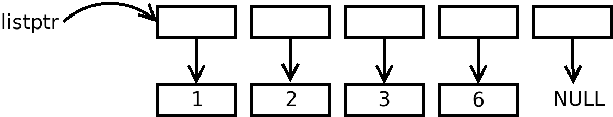

# *alic* Part 17: Strings in Switch, Function Pointers, Iterator Functions and Regular Expressions

As I thought, adding string expressions and string literals to `switch()` and `case` statements was very easy. I won't go through them, but you will be able to spot them in `switch_stmt()` in [parser.c](parser.c) and `gen_SWITCH()` in [genast.c](genast.c). I also imported the `djb2hash()` function into [misc.c](misc.c).

The more interesting changes were the remaining three.

## Function Pointers: Syntax

I've used function pointers in several languages, and I really dislike the way that they are declared in C. So here is my choice for function pointer declarations: they look like a function prototype but with a '*' character after the function pointer's name, e.g.

```
int32 foo(int8 *name, bool is_irregular);    // A function prototype
int32 fred* (int8 *name, bool is_irregular); // A function pointer called fred
```

Yes, the parameter names are not needed; however, it meant that I could re-use my prototype parsing code!

Now, in terms of assigning to a function pointer and then calling via a function pointer, I have gone with this, e.g.

```
int32 foo(int8 *name, bool is_iregular) { return(1); }
int32 bar(int8 *thing, bool subtle)     { return(2); }

public void main(void) {

  // Function pointer and assignment
  int32 fred *(int8 *name, bool is_iregular) = foo;
  ...
  Function pointer assignment
  fred= bar;
  ...
  // Calling via a function pointer
  printf("%d\n", fred("hi", true) );
```

We call via `fred` which actually calls `bar()`. This returns the value 2 which gets printed out.

## Grammar Changes

Here are the changes to the grammar:

```
input_file= ( type_declaration
            ...
            function_pointer_declaration
```

i.e. we can have a global function pointer declaration.

```
function_pointer_declaration= typed_declaration STAR LPAREN
                            ( typed_declaration_list (COMMA ELLIPSIS)?
                            | VOID
                            ) RPAREN (THROWS typed_declaration )?
```

A function pointer declaration looks exactly like a function prototype except for the extra '*' token before the left parenthesis.

```
declaration_stmts= ( ( array_typed_declaration 
                     | function_pointer_declaration
                     )
                     decl_initialisation? SEMI
                     )*
```

And a local declaration statement can now be a function pointer declaration followed an optional initialisation.

## Parsing the Above

I knew this was going to be tricky as there's a lot of assumptions about functions built into the compiler, and I knew I would have to undo/redo a fair bit to get things to work.

The first thing is the add a new symbol type to [alic.h](alic.h):

```
// Symbol types
enum {
  ST_VARIABLE = 1, ST_FUNCTION, ST_ENUM, ST_FUNCPOINTER
};
```

We are going to parse function pointers using `ASTnode`s, so let's also decorate the `ASTnode` structure with a flag:

```
struct ASTnode {
  ...
  bool is_funcpointer;		// True if declaration is a function pointer
  ...
};
```

Now we move to [parser.c](parser.c). In `input_file()`, we now need to spot the '*' in a declaration:

```
   ...
   // Get the typed declaration
    decl = array_typed_declaration();

    // Look at the next token to determine
    // what sort of declaration this is
    switch(Thistoken.token) {
	case T_LPAREN:      // A function
	  ...

	case T_STAR:        // A function pointer
	  // Function pointers cannot return arrays
	  if (decl->is_array == true)
	    fatal("Can't declare %s to return an array\n", decl->strlit);
	  function_pointer_declaration(decl, visibility);
	  break;
      ...
```

We have a new function to do the declaration parsing, but we cheat and call other functions:

```
static void function_pointer_declaration(ASTnode * decl, int visibility) {
  decl= function_prototype(decl);
  global_var_declaration(decl, visibility);
}
```

I've modified `function_prototype()` as follows:

```
static ASTnode *function_prototype(ASTnode * func) {
  ...

  // We already have the typed declaration in func.
  // See if this is a function pointer
  if (Thistoken.token == T_STAR) {
    scan(&Thistoken);
    func->is_funcpointer= true;
  }
  ...
};
```

and `global_var_declaration()` is modified to create a global function pointer symbol with space for it.

Down in `declaration_stmts()` (for local variables), there's code to get the function pointer declaration if we see a '*' after a name:

```
  ...
 // Get one declaration statement
  d = array_typed_declaration();

  // If there is an '*' then we have a function pointer
  if (Thistoken.token == T_STAR) {
    d = function_prototype(d);
  }
  ...
```

Next up, we have to deal with function pointers as expressions. In `function_call()` there are some substantial changes:

```
static ASTnode *function_call(void) {
  ASTnode *s, *e = NULL;
  Sym *sym;

  // Make an IDENT node from the current token
  s = mkastleaf(A_IDENT, NULL, false, NULL, 0);
  s->strlit = Thistoken.tokstr;

  // Get the function's Sym pointer
  sym = find_symbol(s->strlit);
  if (sym == NULL ||
      (sym->symtype != ST_FUNCTION && sym->symtype != ST_FUNCPOINTER))
    fatal("Unknown function %s()\n", s->strlit);

  // Skip the identifier
  scan(&Thistoken);

  // NOTE: At this point we diverge from the grammar given above
  // because we could just be assigning a function to a function
  // pointer. Look for a ';' and it's not a function call.
  if (Thistoken.token== T_SEMI) {
    s->sym= sym;
    s->type = sym->type;
    return (s);
  }
 
  // It is a function call, get the left parenthesis
  lparen();
  ...
```

The only time we should use a function's name is either as a function call or an assignment to a function pointer, where the function's name is always followed by a semicolon.

The next big change is to [genast.c](genast.c) where we deal with assignments in `genAST()`:

```
  case A_ASSIGN:
    switch (n->right->op) {
    case A_IDENT:
      // We are assigning to an identifier.
      // If it's a function pointer, verify that
      // the rvalue is a function with the same parameters etc.
      if (n->right->is_funcpointer)
	gen_checkparams(n);
  ...
```

The new `gen_checkparams()` function walks the parameters of the function (the rvalue of the assignment) and the function pointer (the lvalue of the assignment) to ensure that the number of parameters and their types match.

There are a few minor changes elsewhere in [funcs.c](funcs.c) and [stmts.c](stmts.c) which I'll skip over. We move down to the QBE code generation.

A function pointer is represented in the symbol table as having a return type and a list of parameters. But its storage type is none of these: in fact it's sort of a `void *` type, which is eight bytes on a 64-bit platform.

So if you look at these functions in [cgen.c](cgen.c): `cgglobsym()`, `cgloadvar()` and  `cgstorvar()`, you will see some `ST_FUNCPOINTER` tests which set the type and type size to match `void *`.

The code in `cgcall()` also now has to deal with function pointers. Essentially, we have to load the pointer's value into a temporary and call through that value. Rather than look at the `cgcall()` code, here is some example QBE code:

```
  %fred =l alloc8 8                      # fred is a function pointer, size 8
  %.t11 =l copy $foo
  storel %.t11, %fred                    # Copy foo()'s start address into fred
  %.t14 =l loadl %fred                   # Get the value of the pointer
  %.t15 =w call %.t14(l %.t12, w %.t13)  # and call through the pointer
```

## Iterator Functions

I like regular expressions (yes, I'm strange!) and I've wanted to add them to *alic* for a while. I was going to build them into the language, but I took a step back and thought: perhaps we can write *iterator* functions and then change the `foreach` loop to be able to walk the list that such a function returns.

Here's an example:

```
// Given a number, return a pointer to a contiguous
// list of pointers to factors of that number, with
// NULL the last pointer in the list. Return NULL
// if the number is zero.
uint32 ** factors(uint32 num) { <code> }

public void main(void) {
  uint32 x;

  // Walk the list of pointers
  foreach x (factors(6))
    printf("%d is a factor of 6\n", x);
```

Because we are still interfacing with the existing C library, I had to come up with a way for an interator function to return a useable list that we can walk across. Consider this code:

```
  uint32 ** listptr= factors(6);   // Get a list of the factors of 6
```

The function returns this data structure:



The top row is a contiguous list of pointers to `uint32` values with the last pointer set to NULL. This list was `malloc()`'d by the function. Below that are the `uint32` values that hold the actual factors of 6; these also have been `malloc()`'d by the function.

We can now convert the simple `foreach` code:

```
  foreach x (factors(6))
    printf("%d is a factor of 6\n", x);
```

to a traditional `for` loop:

```
public void main(void) {
  uint32 **list;           // Hidden variable
  uint32 **element;        // Hidden variable
  uint32 x;                // Foreach variable

  list= factors(6);
  if (list != NULL) {
    for (element = list; *element != NULL; element++) {
      x = **element;
      printf("%d is a factor of 6\n", x);
      free(*element);
    }
    free(list);
  }
}
```

This is what we have to achieve! We start with the changes to the grammar:

```
foreach_stmt= FOREACH postfix_variable LPAREN
              ( postfix_variable
              | expression ELLIPSIS expression
              | postfix_variable COMMA postfix_variable
              | function_call
              ) RPAREN statement_block
```

Note that we can have a function call between the parentheses. We need to parse this. In `foreach_stmt()` in [parser.c](parser.c):

```
  // Look at the next token to determine what
  // flavour of 'foreach' we are doing
  switch(Thistoken.token) {
    ...
    case T_RPAREN:
      // We have a function call
      if (initval->op == A_FUNCCALL) {
        // Get the rparen and the statement block.
        rparen();
        s = statement_block(NULL);

        // We will use var as an lvalue
        var->rvalue= false;

        // Check that the function's return value is
        // a pointer pointer to the variable's type
        if (initval->type != pointer_to(pointer_to(var->type)))
          fatal("Foreach loop variable has type %s, function doesn't return %s\n",
                get_typename(initval->type),
                get_typename(pointer_to(pointer_to(var->type))));

        // Build and return the ASTnode for later processing
        return(mkastnode(A_FUNCITER, var, initval, s));
      }
      ...
  }
```

In most of the other `foreach` variants, I chose to hand-build the AST tree that represents the actual `for` loop equivalent. This time, I looked at the equivalent AST tree: it is over 100 AST nodes including all the `A_GLUE` nodes! Argh.

Instead of hand-building the AST tree, I just create an ASTnode with a new operation, `A_FUNCITER`, that holds the loop variable sub-tree (`var`), the function call sub-tree (`initval`) and the loop body (`s`). And in `genAST()` in [genast.c](genast.c) I call a QBE code generation function to hand-build the QBE instructions for the equivalent loop:

```
  case A_FUNCITER:
    return (cg_funciterator(n));
```

The `cg_funciterator()` in [cgen.c](cgen.c) is about 80 lines of code. What I did was generate the QBE code for the traditional `for` loop equivalent and, with some optimisations, print the same code out with `printf()` statements.

Rather than look at all the `printf()` statements in `cg_funciterator()`, let's see what

```
  foreach x (factors(6))
    printf("%d is a factor of 6\n", x);
```

gets translated to:

```
  %.t72 =w copy 6                       # Call the iterator function
  %.t73 =l call $factors(w %.t72)       # %.t73 is listptr, %.t74 is element
  %.t74 =l copy %.t73
  %.t75 =l copy 0
  %.t76 =w cnel %.t73, %.t75            # Compare listptr against NULL
  jnz %.t76, @L26, @L25                 # and skip if it is NULL
@L26
@L27                                    # Top of the foreach loop:
                                        # is *element NULL?
  %.t77 =l loadl %.t74                  # %.t77 holds *element
  %.t78 =w cnel %.t77, %.t75
  jnz %.t78, @L29, @L28
@L29
  %.t79 =w loaduw %.t77                 # Derefernce *element
  storew %.t79, %x                      # Assign **element to loop variable
  %.t80 =l copy $L30                    # The programmer's loop body
  %.t81 =w loaduw %x
  %.t82 =w call $printf(l %.t80, w %.t81)
  call $free(l %.t77)                   # Free *element
  %.t83 =l copy 8
  %.t74 =l add %.t74, %.t83             # element++
  jmp @L27                              # Jump to the top of the for loop
@L28                                    # End of the for statement
  call $free(l %.t73)                   # Free the list pointer
@L25                                    # End of the if statement
```

There was a small wrinkle that I had to deal with: when we are doing `x = **element;` in the rewritten loop, that's a real assignment statement. The left-hand side could be something complicated like `name[5].member.row[7].cost`. We already have code to deal with assignments in `genAST()` but it is slap bang in the middle of a `switch` statement. What I've done is extract this out to a separate function `gen_assign()` in [genast.c](genast.c), so that I could call it from `cg_funciterator()`.

## Regular Expressions

I've spent a while trying to find a suitable regular expression library for C which I could re-purpose for alic. I did look at [pcre2](https://github.com/PCRE2Project/pcre2) but I found it amazingly complicated. Eventually I found this small library, [https://github.com/mfilippa/regex_lib](https://github.com/mfilippa/regex_lib) by Mariano Filippa, and I've integrated this into the *alic* library. The copyright status for the library is unclear, so in [lib/regex_lib.c](lib/regex_lib.c) I've included the author's name and the above link.

I have created a couple of wrapper functions, see [include/regex.ah](include/regex.ah):

```
int8 *** grep(int8 *src, int8 *search);
int8 *   sed(int8 *src, int8 *search, int8 *replace);
```

The first one is an iterator function and the second returns either the string with the replacement or NULL. Test 182 gives you an example:

```
public void main(void) {
  int8 *str;

  int8 *src=     "This is a string with a date: 12/25/2019";
  int8 *regex=   "([0-9]+)/([0-9]+)/([0-9]+)";
  int8 *replace= "$2/$1/$3";

  foreach str (grep(src, regex))
    printf("%s\n", str);

  str = sed(src, regex, replace);
  if (str != NULL)
    printf("Replaced with %s\n", str);
  else
    printf("No replacement\n");
}
```

which prints out:

```
12
25
2019
Replaced with This is a string with a date: 25/12/2019
```

What I should do now/soon is try to better document the types of regular expressions that the library can perform.

## Conclusion and The Next Step

This was quite a mixed bag of additions to the *alic* language. I like having strings in `switch` statements, and the addition of function pointers is nice. I'm *very* happy to finally get some form of regular expressions and with a syntax that doesn't look hideous. I think adding `foreach` to the language has paid off quite well!

At this point, we have nearly 200 tests of the compiler, and two versions of the compiler: one in C and one in *alic* itself. And the *alic* version is self-compiling.

Maybe I should now go a bit sideways and start to write a bunch more serious programs in *alic* and see if I can discover (and fix) more compiler bugs.
