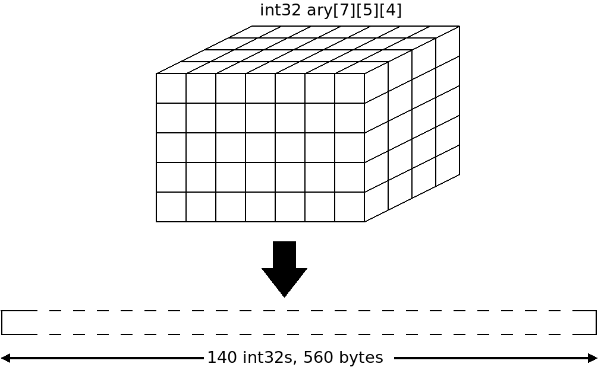

# *alic* Part 20: N-Dimensional Arrays

In this part of the *alic* journey, I'll implement n-dimensional arrays. Some things that we need to consider are:

  * how to create the space in memory for an n-dimensional array,
  * how to represent the number of dimensions and their sizes,
  * how to access elements in the array as both lvalues and rvalues, and
  * how to initialise the elements in an array when it is declared.

But before we get to these things, let's step back and look at some concepts.

## Placing An Array in Memory

Consider this declaration:

```
int32 ary[7][5][4];
```

We see this as a 3-dimensional array, but we have to lay it out in the program's [address space](https://en.wikipedia.org/wiki/Address_space) as a list of contiguous `int32`s:



We have `7 * 5 * 4 = 140 int32`s and, as they are 4 bytes each in size, this ends up being 560 bytes of contiguous memory in the program's address space.

Next up: given three expressions `x`, `y` and `z`, which of the 140 `int32`s is `ary[x][y][z]`? The *alic* compiler is going to have to determine this to access each element individually.

The answer is to add together each index value multiplied by the product of the remaining dimension sizes. That's a big word salad! Let's take an example.

Which of the 140 contiguous `int32`s in memory is `ary[x][y][z]`? It is `(x * 5 * 4) + (y * 4) + z int32`s from the base of the memory allocation. Thus `ary[3][2][1]` is `(3*5*4 + 2*4 +1)` or 69 `int32`s up from the base of the array, or 276 bytes from the base of the array.

Let's also check: `ary[0][0][0]` has offset `(0*5*4 + 0*4 +0) == 0`. And `ary[6][4][3]` (the highest element) has offset `(6*5*4 + 4*4 + 3) == 139`.

## Array Types

Each array is laid out as a contiguous list of elements of the array's type. But each one has an *address* in memory and the array itself has a base address. So, for the above example:


  * `ary` is of type `int32 *` and is the start of `7*5*4==140` contiguous `int32s`
  * `ary[x`] is of type `int32 *` and is the start of `5*4==20` contiguous `int32s`
  * `ary[x][y]` is of type `int32 *` and is the start of `4` contiguous `int32s`
  * `ary[x][y][z]` is a single array element of type `int32`

Given the above, I'm going to extend this and say:

  * `sizeof(ary)` is 140 elements,
  * `sizeof(ary[x])` is 20 elements,
  * `sizeof(ary[x][y])` is 4 elements, and
  * `sizeof(ary[x][y][z])` is 4 bytes as it is a single element.

Similarly:

  * `foreach num (ary)` will iterate across 140 `int32` elements
  * `foreach num (ary[x])` will iterate across 20 `int32` elements
  * `foreach num (ary[x][y])` will iterate across 4 `int32` elements
  * `foreach num (ary[x][y][z])` is illegal as this isn't an array

## Representing Array Dimensions and Sizes

Up to now we have been re-using the `count` member of the `Sym` struct to hold the number of elements in an array. That's fine for 1-dimensional array, but we now have to lose this and replace it with something more general.

In [alic.h](alic.h) I've added this to the `Sym` struct:

```
struct Sym {
  ...
  int dimensions;               // If non-zero, # of array dimensions
  int *dimsize;                 // List of sizes per dimension
  ...
};
```

It's also in the `ASTnode` struct as we build an `ASTnode` tree when we are declaring a variable. It will get copied into the final `Sym` node. The dimension, when non-zero, is also the new way to determine if a symbol is an array:

```
// Return if a symbol is an array, in syms.c
bool is_array(Sym * sym) {
  return (sym->symtype == ST_VARIABLE && sym->dimensions > 0);
}
```

Also in this file there is a helper function to get the number of elements in an array, either from the top (level 0) or the subset of elements when we have a fixed depth (see my `sizeof()` examples above):

```
// Get the number of elements in an array from
// a certain depth downwards. Depth 0 gets the
// total number of elements
int get_numelements(Sym *sym, int depth) {
  int count= 1;
  int i;

  for (i= depth; i < sym->dimensions; i++)
    count = count * sym->dimsize[i];

  return(count);
}
```

## Grammar Changes

We now have to allow multiple array dimensions, so here are the changes to the grammar:

```
array_size= (LBRACKET NUMLIT RBRACKET)+

sizeof_expression= SIZEOF LPAREN type RPAREN
                  | SIZEOF LPAREN postfix_variable RPAREN

postfix_variable= IDENT
                | postfix_variable DOT IDENT
                | postfix_variable (LBRACKET expression RBRACKET)+
```

I won't go through the `postfix_variable()` change just yet, but here is `array_size()`:

```
// Get the dimensions of an array.
// Return a list of dimension sizes
// and the number of dimensions.
//
//- array_size= (LBRACKET NUMLIT RBRACKET)+
//-
static int *array_size(int *num) {
  int max= 10;          // An arbitrary choice
  int i=0;
  int *list;

  // Make the list of dimension sizes
  list= (int *)Malloc(max *sizeof(int));

  while (i < max) {
    // We've already skipped the leading '['.
    // We must see a NUMLIT
    if (Thistoken.token != T_NUMLIT)
      fatal("Array dimension missing in [ ]\n");

    // We need an integer NUMLIT which isn't negative
    if ((Thistoken.litval.numtype == NUM_FLT) || (Thistoken.litval.intval < 0))
      fatal("Array dimension must be a positive integer literal\n");

    // Get the dimension's size, skip the NUMLIT and ']'
    list[i] = (int) Thistoken.litval.intval;
    scan(&Thistoken);
    match(T_RBRACKET, true);

    // Stop looping if the next token is not a '['
    if (Thistoken.token != T_LBRACKET) break;

    // It is, so skip it and loop back
    scan(&Thistoken);
    i++;
  }

  // Return the list and number of dimensions
  *num= i+1;
  return (list);
}
```

Yes a lot of code to parse something as simple as `[7][5][4]` !

The `sizeof_expression()` function is now slightly more complicated as we could either have a type or a postfix variable. We now need to "peek" and see if we have a type. If not, then we can call `postfix_variable()`. Here is some of the code:

```
static ASTnode *sizeof_expression(void) {
  ASTnode *e;
  Type *ty;
  int count;

  // Skip the keyword, get the '('
  scan(&Thistoken);
  lparen();

  // Do we have a type?
  ty= match_type(true);            // true means don't skip it

  // Skip the type if we have one
  if (ty != NULL) {
    ty= match_type(false);         // false means skip it
  } else {
    // It could be a postfix variable.
    // Scan it and check
    e= postfix_variable(NULL);
    if (!is_postfixvar(e))
      fatal("Can only do sizeof(variable) or sizeof(type)\n");

    // If this is an array, get the number
    // of elements from this dimension downwards
    if (e->is_array) {
      count= get_numelements(e->sym, e->dimensions);
    }
    ...
  }
  ...
}
```

## Allocating Array Memory

There are two places where we need to determine the size of an array, one in [genast.c](genast.c) and the other in [cgen.c](cgen.c). I've written a separate function in [syms.c](syms.c) which is now called by both places:

```
// Determine the size of a variable
int get_varsize(Sym *sym) {
  Type *ty;
  int size;

  // Arrays. Get the type of each element and
  // multiply the type size by all the dimension sizes
  if (is_array(sym)) {
    ty = value_at(sym->type);
    size = ty->size * get_numelements(sym, 0);
  } else {
    size = sym->type->size;
  }
  return(size);
}
```

Now when we compile this program:

```
int32 ary[7][5][4];

public void main(void) {
  int32 foo[7][5][4];
}
```

we get:

```
data $ary = align 8 { z 560 }
export function  $main() {
  ...
  %foo =l alloc8 560
  ...
}
```

## Accessing Elements in an Array

This gets handled down in `postfix_variable()` in [parser.c](parser.c) once we have seen a `T_LBRACKET` token and determined we are not processing an associative array. I will cut some code out to make it easier to follow. Note that we now loop here to parse successive square brackets.

```
  ASTnode *idx=NULL;
  ...
    // A normal array
    if (is_array(sym)) {
      // Loop to deal with each dimension in the input
      while (1) {
        // Too many dimensions
        if (dimlevel == sym->dimensions)
          fatal("Too many array dimensions for %s\n", sym->name);

        // We already have an expression for this level.
        // Get the AST tree for this
        idx= get_ary_offset(sym, e, idx, dimlevel);
        dimlevel++;

        // Get the trailing right bracket
        match(T_RBRACKET, true);

        // Stop looping if the next token isn't a left bracket
        // Otherwise, skip it and get the next expression.
        if (Thistoken.token != T_LBRACKET) break;
        scan(&Thistoken);
        e = expression();
      }

      // Add the index to the array's base
      n= binop(n, idx, A_ADDOFFSET);
      ...

      // If this is the lowest dimension,
      // dereference it so we can get the
      // element's value.
      if (dimlevel == sym->dimensions) {
          n= unarop(n, A_DEREF);
          n->type= value_at(n->type);
          ...
        }
      } else {
        // We are not at the lowest dimension,
        // so mark the node as an array, add
        // in the array symbol and the current
        // dimension level. sizeof() uses this.
        n->is_array= true;
        n->dimensions= dimlevel;
        n->sym= sym;
      }

      return (postfix_variable(n));
    }
```

There's a helper function in [expr.c](expr.c) which helps to build some of the AST tree to do the access. I'll give the comments:

```
// Given a symbol, an index expression at the dimension
// indicated by level, return an ASTnode which holds the
// linear index of the expression with correct type.
//
// This get called where prevoffset is the result of the previous
// dimension calculation or NULL.
//
ASTnode *get_ary_offset(Sym *sym, ASTnode *e, ASTnode *prevoffset, int level) {

  // Build an A_BOUNDS node with e and the size of this dimension

  // Get the size of the elements in the array
  // Multiply this with the product of the sizes of the remaining dimensions

  // Add this to any previous get_ary_offset() value

  // Return the new tree
  return(e);
}
```

## An Example of Array Access

Given this code:

```
int32 ary[7][5][4];

public void main(void) {
  printf("%d\n", ary[3][2][1]);
}

```

the new code in `postfix_variable()` creates this AST tree:

```
int32 DEREF  rval                  i.e. deference the following address
  int32 * A_ADDOFFSET  rval        i.e add the base of ary to
    int32 * IDENT ary rval

    int32 * ADD  rval              i.e. check 1, then 1 * 4 added to
      int64 MULTIPLY  rval
        int64 BOUNDS  rval
          int64 NUMLIT 1 rval
          int64 NUMLIT 4 rval
        int64 NUMLIT 4 rval

      int64 ADD  rval              i.e. check 2, then 2 * 16 added to
        int64 MULTIPLY  rval
          int64 BOUNDS  rval
            int64 NUMLIT 2 rval
            int64 NUMLIT 5 rval
          int64 NUMLIT 16 rval

        int64 MULTIPLY  rval       i.e. check 3, then 3 * 80
          int64 BOUNDS  rval
            int64 NUMLIT 3 rval
            int64 NUMLIT 7 rval
          int64 NUMLIT 80 rval
```

## Changing `foreach()`

I found the above annoying, and then I got to do `foreach()` and this was painful! Then, getting array initialisation right was even more painful.

With the `foreach()` loops (which are syntax variants of a proper `for` loop), we have the choice of either hand-building an AST tree or hand-generating the output QBE code for the loop.

For the previous array iterating `foreach()` loop I was hand-building the AST tree. This time it turned out to be so complicated that I converted it all to a function to generate QBE code: `cg_arrayiterator()` in [cgen.c](cgen.c).

To get to the point where we call this function, in the `foreach_stmt()` code in [parser.c](parser.c):

```
      ...
      // A normal array
      if (listvar->is_array) {

        // Check that the variable is the same type
        // as the elements in the array
        if (var->type != value_at(listvar->type))
          fatal("foreach variable not same type as array elements\n");

        // Determine the number of elements in the array
        // and put it in the listvar node
        listvar->count= get_numelements(listvar->sym, listvar->dimensions);

        // Get the rparen and the statement block.
        rparen();
        s = statement_block(NULL);

        // We will use var as an lvalue
        var->rvalue= false;

        return(mkastnode(A_ARRAYITER, var, listvar, s));
      }
```

which falls into `genAST()` in [genast.c](genast.c):

```
  case A_ARRAYITER:
    // Add a Breaklabel node
    this = (Breaklabel *) Malloc(sizeof(Breaklabel));
    this->continue_label= genlabel();
    this->break_label= genlabel();
    this->prev = Breakhead;
    Breakhead = this;
    cg_arrayiterator(n, this);
    // Remove the Breaklabel node
    Breakhead = this->prev;
    return(NOTEMP);
```

Remember, we have to build the `Breaklabel` node so that any `break` and `continue` inside the loop's body will have some QBE labels to jump to.

I won't go through the code in `cg_arrayiterator()`. Instead, I'll describe how it works.

We need two hidden variables; one is a pointer to the next element, which we can increment by the size of the elements in the array. Another is the current index value. We loop with the index going from zero up to the size of the array. Inside the loop, we dereference the pointer to get the next element's value, then run the loop body. After that, we increment the index by 1 and the pointer by the element's size.


## Array Initialisation

Previously, we were in the happy situation that we only needed to look at the `count` in a symbol and walk a list of AST nodes to see that the count was the same.

Now we have arrays with multiple dimensions. Even worse, we can have structs with n-dimensional arrays as members. Now it's very complicated.

I know I spent a lot of time touching a heap of code in [parser.c](parser.c). In many places I had to copy the "array-ness" from a symbol (i.e. the `dimensions` and `dimsize` fields) into AST nodes and vice versa.

> As an aside, when we have an n-dimensional array inside a struct, we need to determine its size. As the array member isn't a symbol (yet), we have to calculate its size manually. Look for code that mentions `dimsize` in `add_memb_to_struct()`.

In terms of actual array initialisation, the main change is this code in `check_bel()` where we check the number of elements and their type inside an bracket element list:

```
  // The symbol is an array. Get the elements' type.
  // Use the count of elements and walk the list
  // (it used to use ->count instead of get_numelements()
  if (is_element==false && is_array(sym)) {
    ty= value_at(sym->type);
    for (i = 0; i < get_numelements(sym,0); i++, list = list->mid) {
      check_bel(sym, list, offset + i * ty->size, true);
    }
```

But you should definitely search for the word `dimsize` everywhere through the code base to see the changes that I've made.

To make it easier on the parsing, I've written the code so that all the initial element values in an array must be inside a single bracket element list, e.g.

```
int16 foo[2][2][2] = { 1, 2, 3, 4, 5, 6, 7, 8 };
```

## Tests For Arrays

The original 1-dimensional array tests work fine; tests 209 to 212 test n-dimensional arrays. I'm sure I should add more tests in here.

## Conclusion and The Next Step

Wow, that was not pleasant. I'm also sure that the code is fragile in places, so I am sure I will be revisiting the changes that I've made.

Next up, I should try to work out how I can initialise local variables which are arrays and structs. Right now I simply initialise all their bits to zero. To properly intialise local structs and arrays, I have to generate QBE code to a) get the correct offset of the element/member and b) assign an expression's value to that address. It is essentially a sequence of assignment statements, so the resulting code will *not* look nice.


